<h1 align="center">Eterris CRM 📊</h1>

<p align="center">
  A full-stack, responsive Customer Relationship Management (CRM) platform built to streamline sales workflows, manage leads, and provide real-time pipeline analytics.
</p>

<p align="center">
  <strong>🔗 <a href="">View Live Demo</a></strong>
</p>

<p align="center">
  
  
  
  
  
</p>

---

## ✨ Key Features

- **Interactive Dashboard:** Real-time revenue tracking, pipeline composition, and lead source analytics utilizing custom-animated Chart.js graphs.
- **Kanban-Style Pipeline:** Visualize and manage leads across different stages (New, Contacted, Qualified, Proposal Sent, Closed).
- **Agent Workload Management:** Track agent performance, assign leads, and monitor individual sales velocities.
- **Advanced Filtering & Sorting:** Backend-driven filtering, search, and sorting mapped to URL parameters for shareable and persistent state.
- **Activity Timeline:** Log calls, notes, and updates with automated system logs for lead stage changes.
- **Robust Backend APIs:** RESTful CRUD endpoints for leads and agents with validation, filtering, and clean data modeling.
- **Beautiful UX/UI:** Fully responsive design built with modern CSS Flexbox/Grid, enhanced with SweetAlert2 modals and toast notifications.

---

## 🛠️ Tech Stack

**Frontend:** React.js, Vite, React Router DOM, Chart.js, Lucide React, SweetAlert2, React Toastify  
**Backend:** Node.js, Express.js, RESTful APIs, Mongoose, dotenv, CORS  
**Database:** MongoDB

---

## 🔐 Environment Variables

```env
VITE_API_BASE_URL=http://localhost:5000
```
---

## 🧩 Installation & Setup (Local)

Clone the repo  
```bash
git clone https://github.com/badaltomar/eterris
npm install
npm run dev
```
App will run on: http://localhost:5173/

---

## 🤝 Contributing

- Fork the repository
- Create a new branch (feature/my-feature)
- Commit changes
- Push to the branch
- Open a pull request

---

## 🧑‍💻 Author

- [Badal Tomar](https://github.com/badaltomar)

---

## Screenshots

<p align="center">
  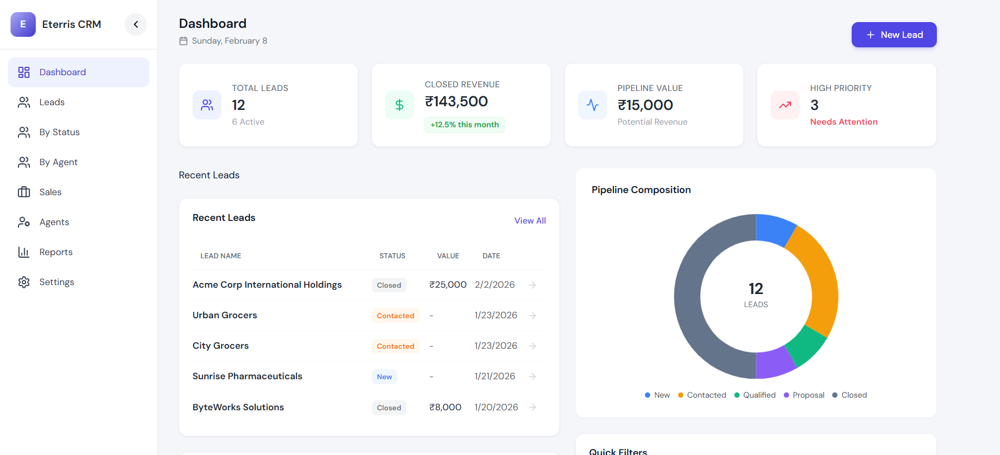
  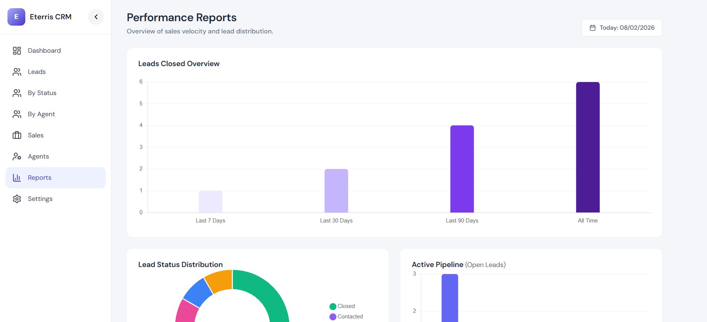
</p>
<p align="center">
  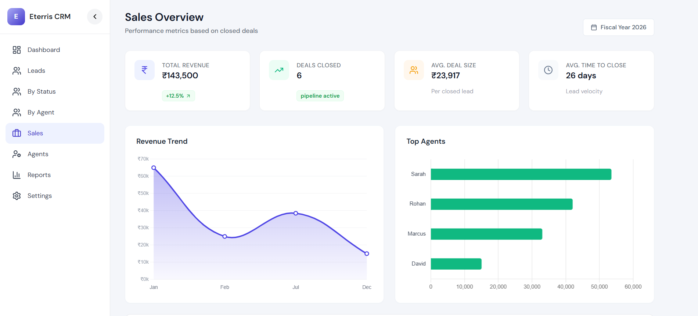
  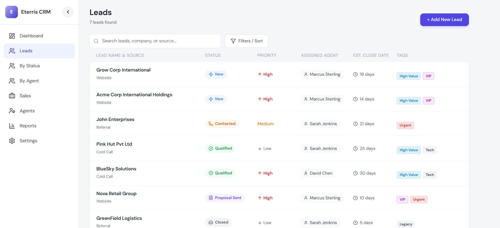
</p>
<p align="center">
  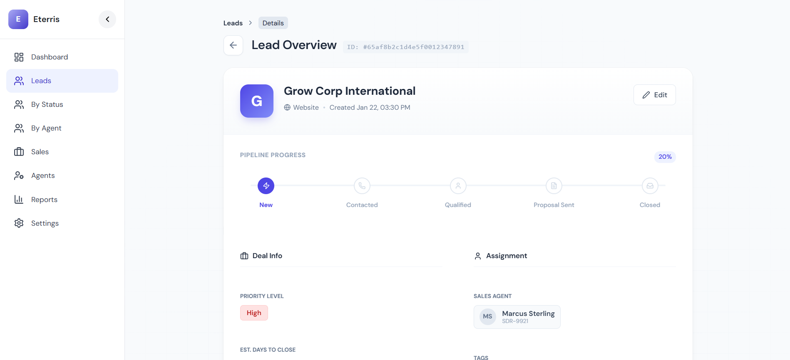
  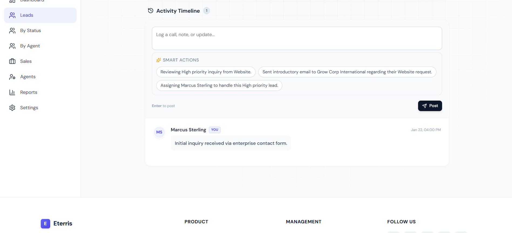
</p>
<p align="center">
  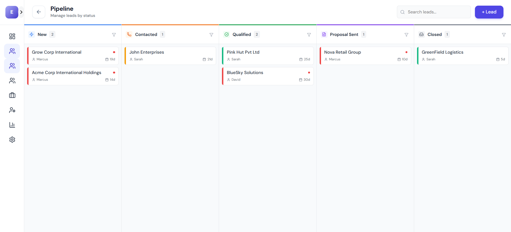
  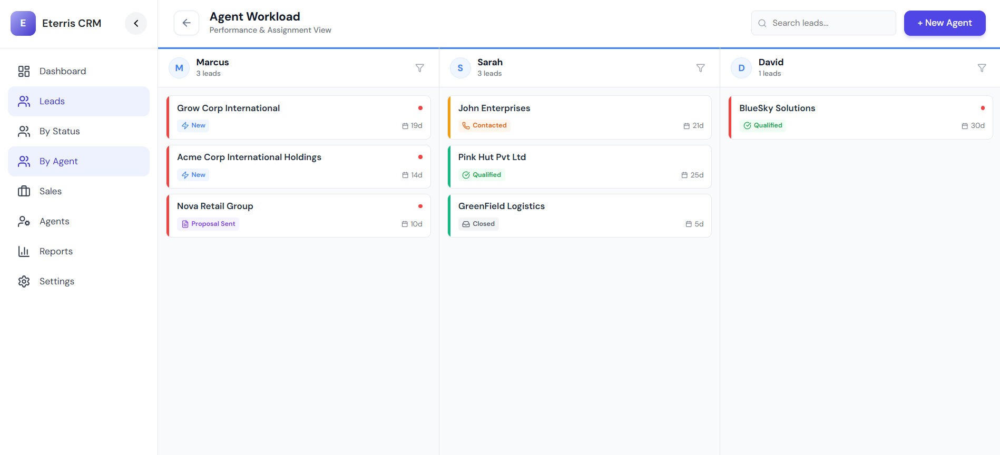
</p>
<p align="center">
  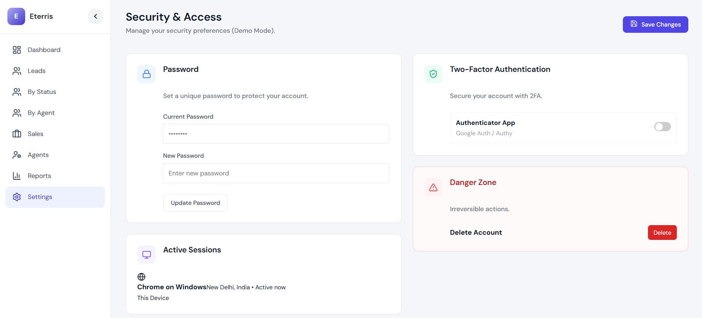
  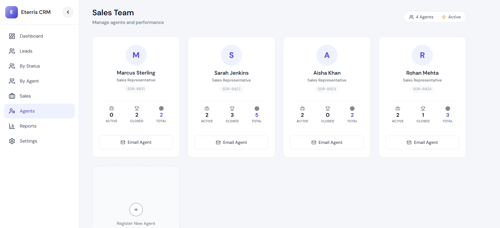
</p>
<p align="center">
  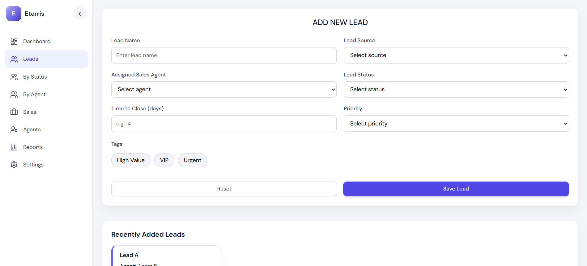
  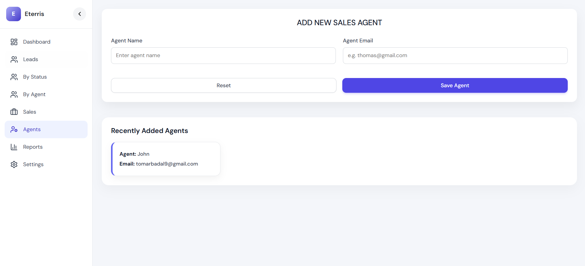
</p>
